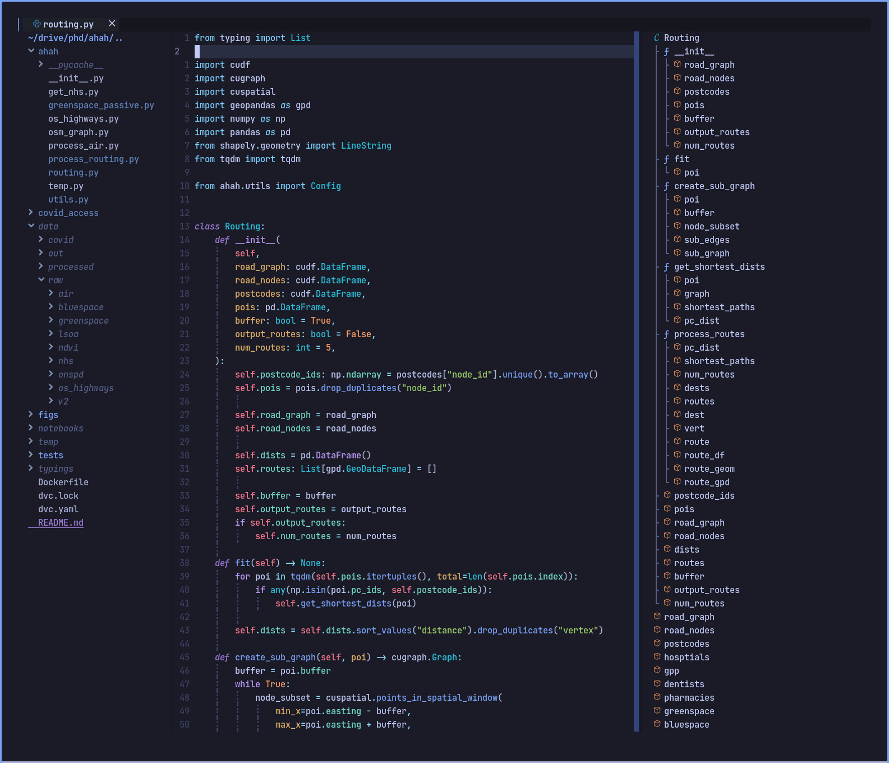

# cjber dotfiles

**Currently migrating over to Wayland**

Uses [Dotdrop](https://github.com/deadc0de6/dotdrop) for different
configs depending on the host.

``` bash
git clone https://github.com/cjber/dotfiles.git
cd dotfiles/restore
chmod +x *
bash restore_all
bash dots
```


