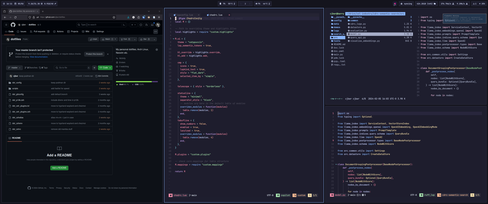

# Dotfiles Configuration

This repository contains my personal dotfiles configuration for my Arch Linux setup with Hyprland on Wayland, managed using `chezmoi`.



## Setup

To use these dotfiles, simply execute the following one-liner to install and apply the configurations using `chezmoi`:

```bash
export GITHUB_USERNAME=cjber
sh -c "$(curl -fsLS get.chezmoi.io)" -- init --apply $GITHUB_USERNAME
```

To update dotfiles on an existing system use:

```bash
chezmoi update
```
