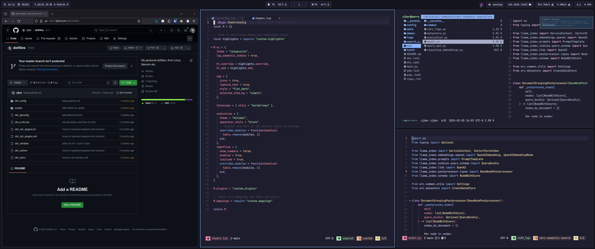

# Dotfiles Configuration

This repository contains my personal dotfiles configuration for my Arch Linux setup with Hyprland on Wayland, managed using [`dotter`](https://github.com/SuperCuber/dotter).



## Setup

Clone the repo and deploy with dotter:

```bash
git clone git@github.com:cjber/dotfiles.git ~/.dotfiles
cd ~/.dotfiles
dotter deploy
```

To update on an existing system:

```bash
cd ~/.dotfiles && git pull && dotter deploy
```
