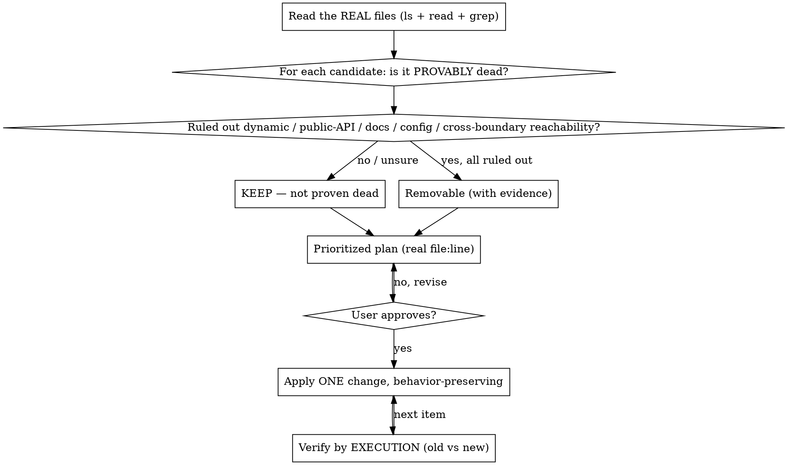

# Deadcode — Cleaning Up Projects

## Overview

Cleaning up a project is **not** "find what looks unused and delete it." Tools (`vulture`, `ruff`, `knip`, `ts-prune`, `depcheck`) find *candidates*. The skill is *judgment*: proving a thing is actually safe to remove, and not changing behavior while you tidy.

**Core principle: the absence of a reference is not proof of death.** A symbol with zero static call sites can be very much alive — reached by dynamic dispatch, exported as public API, invoked from docs/ops, looked up by string from config, or reached cross-boundary from another runtime/service/manifest. A missing `grep` hit is often the *symptom* of dynamic access, not evidence the code is dead. Deleting on "no callers found" is how you ship a silent breakage.

**Second principle: cleanup is a behavior-preserving change.** Removing cruft and simplifying must not alter what the code does — and "looks equivalent" is not "is equivalent" (the `value == 0` row survives only because of `is not None`, not truthiness).

**Third principle: removal and consolidation are the same discipline.** This skill covers both *removing* dead code and *merging* duplicated/parallel implementations into one source of truth — done **top-down**, at the producer, so the fix cascades to every consumer instead of being reconciled copy-by-copy. Both are behavior-preserving, both are gated by the Iron Rule, and both treat prose as part of the tree: docs, specs, and rule/skill files that reference removed or merged logic are dangling cruft to fix in the *same* change. Cleanup *removes*; consolidation *merges* — the judgment (prove-then-change, don't alter behavior) is identical.

**Fourth principle: proven-dead is proven-dead, wherever it lives — and "used" means used by *production*.** Two corollaries that decide most real sweeps:
- **A dead symbol inside a *live* module is still dead — remove it.** Do not spare an unused class/function/method just because the file around it is imported, or because the name is nominally "public" in an application. Once a symbol is proven unreachable through **all five** paths below (including cross-repo), it is removable in the same sweep as any dead file — code is cheap, dead code is ongoing maintenance and reader-tax. "Narrowing the public API is a separate deprecation" applies ONLY to surface with a *genuine external/off-disk consumer* (a published library export, a served route, a field at rest) — not to an internal symbol that grep+graph+cross-repo prove nobody reaches.
- **Referenced only by a test = product-dead.** A symbol whose only callers are tests is not alive — the test is exercising code that nothing ships. Seed reachability from **production** entrypoints, never from tests. When a symbol is test-only, the symbol AND its test are the dead pair; remove both together (a test that tests dead code is itself dead). The exception is genuine *test infrastructure* (fixtures/helpers whose job is to support other tests) — that is live test code, not product-dead.

**Fifth principle: absence of a reference cuts both ways — vulture-style tools MISS dead code, not just over-flag it.** A per-file, name-based scanner (`vulture`, `deadcode`, `pyflakes`) counts a symbol as "used" if *any* file — including another already-dead module, or a test — names it. So it is structurally blind to **dead islands** (modules that only import each other) and to **dead-referenced-by-dead** chains. "It didn't show up in vulture" is NOT evidence of life. Catching the code you *miss* needs whole-program **reachability from real roots** (see Phase 1) plus **fixpoint iteration** — delete a layer, re-run, and the next layer of now-orphaned code surfaces.

## When to Use

- "Почисти / clean up / declutter / remove dead code / unused imports / commented-out code / reduce complexity" across a project
- Before deleting any symbol, file, or dependency that "looks unused"

**When NOT to use:** tidying only the code you just changed → use `/simplify`. Pure mechanical *reformatting that deletes nothing* (`ruff format`, `prettier` — whitespace/quotes/import-ordering only, on scoped files) → just run the formatter; don't hand-edit it here. This does NOT include deletion-capable autofix (`ruff check --fix`, `eslint --fix`, `autoflake`, `depcheck` prune) — those remove code and are gated by the full Iron Rule (Phase 5), never "just run it".

## The Iron Rule

```
NO DELETION OR EDIT WITHOUT (1) READING THE REAL FILES, (2) PROVING NON-USE, AND (3) USER APPROVAL.
```

This is **analyze → prove-dead → prioritized plan → APPROVAL → apply → verify.** Grep-verifying non-use authorizes *proposing* a removal — never executing it.

**"Change" means ANY filesystem write** — deleting a file/symbol, editing, creating new/test/scaffold/temp files, *and* anything a tool writes: a formatter/linter `--write`/`--fix`, a codemod, a manifest/lockfile edit. A command that would write more than the files in your approved plan needs its own approval. **The gate is unconditional:** "obviously dead", "trivial", "zero-risk", "it still parses", "it's only formatting" are not exemptions — they are the rationalizations the gate exists to stop.

## Workflow



## Phase 1 — Survey (read the real files first)

- `ls` the tree, read candidates, `rg -n` for every symbol across the **whole** repo. Use `rg` to *locate* — then open and read the body with **Read**; any line-slicing window (`grep -A/-B/-C`, `sed -n`, `awk NR`, head/tail — contiguous or not) is a keyhole, not a read.
- **Show evidence**: real paths and the actual reference hits (or their absence). A claim of a survey is not a survey.
- The survey is **read-only** — ZERO writes of any kind. Candidate-finders (`ruff`, `vulture`, `mypy`, `pytest`) emit caches (`.ruff_cache`, `.mypy_cache`, `.pytest_cache`, `__pycache__`); run them with caching off (`ruff --no-cache`, `python -B`) or `rm` the cache immediately, then re-confirm the tree is byte-identical to its original state.

### Don't rely on a single name-scanner — it misses the code you most want to find

A per-file name-based tool (`vulture`, `deadcode`) is a *recall floor*, not the survey. It cannot see dead islands or dead-referenced-by-dead (fifth principle). For a reliable sweep, generate candidates from an **intersection of independent signals**, then prove each (Phase 2). No single layer is a delete signal:

1. **Cheap exact wins first** — `ruff check --select F401,F811,F841` (unused imports/redefs/locals): near-zero false positives, shrinks the noise the later layers wade through.
2. **Module reachability (recall — the layer that catches what you miss)** — build the import graph and report every module reachable from **no root**. In Python use **grimp** (`grimp.build_graph("src")` → `find_upstream_modules(root)`; it's maintained and powers import-linter). Seed the roots from *production* entrypoints — packaging `[project.scripts]`, framework-registered handlers (`@router`/`@app`/`@DBOS`/task/cron decorators), `__main__` scripts — **never tests**. This is the only layer that surfaces whole dead files a name-scanner rates "used".
3. **Cross-repo allowlist (kills the big false-positive class)** — if a sibling repo imports this one, enumerate every `src.*` symbol it consumes (`grep -rhoE '(from|import) src(\.\w+)+' ../sibling`) and add those to the root set. Otherwise everything the sibling uses looks dead locally. Refresh it in CI so the two repos never delete each other's dependencies.
4. **Coverage for aliveness (subtracts false positives)** — run the suite **plus representative traffic** (exercise the API/worker/CLI, not just pytest) under `coverage run --source=src`; anything whose lines executed is alive. Zero-coverage is only meaningful *with* real traffic — a pytest-only run over-flags routes/workflows. This is the one signal that proves dynamically-dispatched code (registries, `getattr`, DBOS name-dispatch) live.
5. **Framework-aware scanner as corroboration** — a tool that models routes/fixtures/ORM lifecycle (e.g. `skylos`) agreeing with vulture raises confidence; treat any single tool's benchmark as author-marketing, trust the *intersection*.

Delete only `(reachability ∪ scanner) − executed − roots − cross_repo_allowlist`, then **iterate to a fixpoint**: removing one island orphans the next. *(nebula: `uv run dead-code` runs the vulture symbol pass + the grimp module-reachability pass with these roots + the parallax allowlist already wired; `[tool.vulture] ignore_decorators` suppresses framework symbols structurally.)*

## Phase 2 — Prove it's dead (the judgment that makes this a skill)

For every removal candidate, you must **positively rule out every non-static reachability path** before calling it dead. Zero static references is the *start* of the investigation, not the end.

**Ruling a path OUT is an evidence-bearing claim, exactly like ruling it IN.** You may not clear a path by re-grepping the symbol name — that's the same blind search the gate distrusts. Each path needs a *different-kind* affirmative search (read the registry/dispatch/decorator body and enumerate its keys; grep the string KEY or prefix, not the symbol; enumerate `__all__`/`entry_points`; search config/IaC). The search must be **exhaustive for that path** — enumerate ALL registries/dispatch sites/`__init__` re-exports/config+IaC files and sibling repos, not one example, and show the command that scoped the whole repo; if you can't enumerate the full set, the path is NOT ruled out → KEEP. A bare "might be dynamic / could be in config" with no shown search is an **un-run check, not a valid KEEP** — and an absent name-grep is **not proof of death**.

**Reachability checklist — rule out all five:**
1. **Dynamic dispatch** — `getattr`/`setattr`, `globals()`/`locals()`, `importlib`, `__getattr__`, reflection, registries/plugin tables, decorators that register, string-keyed lookups (`getattr(handlers, "handle_" + name)`).
2. **Public API** — `__all__`, package `__init__` re-exports, `entry_points`, any non-underscore name in a library, framework-magic names (Django models/signals, pytest fixtures, route handlers, serverless entrypoints).
3. **Docs / manual / entrypoints** — README runbooks, ops scripts, CLI commands, cron, migrations run by hand.
4. **Config / data-driven** — names referenced by string from config files, templates, env, or data.
5. **Cross-boundary** — invoked from another language/runtime/repo: HTTP/RPC route names, message-queue task names, ORM/DB triggers, FFI, shell/Dockerfile/systemd/k8s/CI manifests, or a known downstream repo. Grep the symbol AND its route/task string across deploy/IaC files and sibling services, not just this repo's primary language.

**Two hard STOPs — a name-grep is meaningless here:**
- If ANY dispatch/registry/import site **builds a name** by concatenation/f-string/formatting (`"handle_" + name`, `f"{base}_{x}"`), every symbol matching that prefix/suffix is **presumed reachable** — enumerate the runtime values of the variable part (from config/enums/DB) and prove your symbol is not among them, else KEEP.
- A symbol carrying ANY **decorator** is presumed reachable via that decorator's side effect until you read the decorator and prove it doesn't register/route/schedule it. Zero call sites is meaningless for a decorated symbol — the framework is the caller.

> If you cannot rule all five out, it is **not proven dead → KEEP** and flag it. A name with zero search hits is often the fingerprint of dynamic access, not proof of death.

**Classify each candidate:**

| Bucket | Test | Action |
|--------|------|--------|
| **Proven dead** | Zero refs AND all **five** reachability paths (incl. cross-boundary) ruled out, each with cited evidence | Removable — with evidence, after approval |
| **Live via indirect** | Reachable via dynamic dispatch / reflection / registry | **KEEP** |
| **Genuine external surface** | Has a *real* off-disk/downstream consumer — a served route, a published library export, a cross-repo import, a field/value at rest | **KEEP** — narrowing it is a *deprecation* decision needing downstream confirmation, out of scope for a sweep |
| **Nominally-public but proven-unused** | Non-underscore name, but grep + import-graph + **cross-repo** all confirm zero consumers | **Removable** — a "public"-looking name in an app with no actual consumer is dead; remove it in the sweep (fourth principle). Don't inflate it to untouchable to dodge the work |
| **Test-only** | Only callers are tests (not test *infrastructure*) | **Removable** — product-dead; remove the symbol AND its test together (fourth principle) |
| **Deliberate artifact** | `DO NOT DELETE` marker, reference impl, live `TODO`/`FIXME`, documented ops tool | **KEEP** — an explicit in-file directive overrides a generic "remove cruft" request |
| **Just complex** | Working code that's only convoluted | *Simplify* behavior-preservingly, or leave — don't delete |

**Public vs. private:** absence from `__all__` does NOT make a name private — any non-underscore top-level name is importable and presumed public. "It's an app, no consumers" is NOT a license to delete a public name: an app's public surface is reached **cross-boundary** (route handlers, CLI subcommands, serverless/MQ task names, manifest `command:`/`entrypoint` entries), almost never by import — so "no module imports this" is the WRONG test. An externally-facing entrypoint — route handler, CLI subcommand, serverless/MQ task, manifest `command:` entry — is framework-magic **Public API → KEEP**. Its caller is the framework, an external client, or a human operator, none of which leave an on-disk reference, so an **empty cross-boundary grep is the EXPECTED state of a LIVE entrypoint, not proof of death**. You may NOT downgrade it on absence of on-disk references; removal requires POSITIVE decommission evidence — the route/command is removed from the served router/CLI registration, returns 404/unknown-command in the running app, AND it's an approved deprecation with downstream/operator sign-off. Absent that → KEEP. Don't inflate an internal helper to "public, untouchable" to dodge the analysis either; when genuinely unsure, treat as public and KEEP.

## Phase 2b — Non-code & off-disk reachability (worked traps)

The five paths above have recurring concrete shapes where **an empty grep is the *expected* look of live code, not evidence of death.** Each generalizes across repos; the parentheticals cite where a given ecosystem writes the rule down (examples here are from the `nebula` repo) so you don't re-derive it.

- **Durable-workflow step names.** A durable/orchestration step (DBOS `@DBOS.step`, Temporal activity, Celery task) is resumed by its *pinned string name from persisted in-flight state*, not from a static call site. A step function with zero callers can still be mid-flight in a running workflow; deleting or renaming it breaks those runs. → KEEP unless you prove no in-flight or scheduled workflow references the name. *(nebula: every step pins `name=`; AGENTS.md "DBOS Workflows", triggers skill §T-7.)*
- **Enum / literal values at rest.** A `StrEnum`/`Literal` member with zero code references may still exist as a *stored value in the database* (persisted as text). Deleting the member breaks row-load for every existing row carrying it. Query the data for the value (`SELECT DISTINCT col`), don't just grep code. → KEEP unless the value is provably absent at rest. *(nebula: enums stored via `Enum(..., native_enum=False, values_callable=...)`; AGENTS.md SQLAlchemy.)*
- **Migration chains are append-only.** A migration file is never "old dead code" — migrations form a linked `down_revision` chain; deleting one breaks `upgrade`/`downgrade` on every environment that has not already run past it. → NEVER delete a migration to tidy. *(nebula: AGENTS.md Database.)*
- **Name-dispatched plugin registries.** Tools/agents/handlers registered by string into a registry and dispatched by name (LLM-selected tool names, route tables, entry-point plugins) have no static caller — the registry is the caller. → KEEP; enumerate the registry's keys, not the symbol. *(nebula: `ToolName` + toolset/agent/toolkit registries; AGENTS.md "Dead Code Detection" false-positives.)*

**Docs, specs, and rule/skill files are part of the tree — in BOTH directions:**
- A prose reference (README, runbook, in-repo skill, `AGENTS.md`/design doc) to logic you are *removing or merging* becomes dangling cruft the moment the code goes — fix or delete it in the **same** behavior-preserving change so code and docs never drift. Enumerate mentions with `rg` across `*.md`/docs, not just source; a symbol rename with a stale doc line is a half-done change.
- But a doc mention is **not** a keep-alive signal. Docs go stale independently: a symbol referenced *only* in prose (never reached by code, config, or any of the five paths) can still be dead — the doc is simply describing already-removed or never-wired logic. Prove death by the code paths; then the sweep removes the dead symbol **and** its stale mention together. (Worked shape: an enum member that no code path constructs, still named in a skill doc — the member is dead *and* the doc line is stale; both get fixed, after approval — never delete the mention while leaving a live symbol, or vice versa.)

## Phase 2c — Load-bearing code that looks dead or redundant (production invariants)

Beyond reachability, a production codebase carries code that *looks* removable or redundant but is a live safety, correctness, or scale guarantee. These are **proven-alive** classes — a "cleanup" that strips one is a regression, not tidy. Prove a candidate is NOT one of these before removing; when unsure → KEEP.

- **Idempotency / dedup / guarded mutations.** A dedup-key check, `INSERT ... ON CONFLICT`, or `update().where(status="pending")` guard looks redundant on the happy path — it exists so a *retry* doesn't double-apply. Removing it is a duplicate-processing bug visible only under retry / at-least-once delivery. *(nebula: engineering-principles "Idempotency on write paths that retry".)*
- **Security / scope / validation defense-in-depth.** A `workspace_id` predicate, permission/access check, or "redundant" re-validation at a second boundary is intentional layering. Removing it is a data-leak or authz regression, not cleanup. *(nebula: workspaces skill `workspace_scope_gate` / `access_filter` — every scoped read filters `workspace_id`.)*
- **Feature-flag / kill-switch / rollout code.** Code behind a flag is *statically unreached with the flag off* yet is a live rollback lever; deleting it removes the ability to turn the feature off in prod. → KEEP until the flag itself is retired as a deliberate, separate step.
- **Compatibility at rest (generalises the enum-at-rest trap).** A column, serialized event/message payload field, or API response field with no *current* code reader may still be **written by a prior deploy, carried by stored rows, in-flight in a queue, or read by an old client**. You cannot delete what the previous version still writes or a persisted record still holds — that's a multi-deploy *expand-contract*, not a sweep. → KEEP; retire in phases.
- **Observability with off-disk consumers.** A metric, log field, or trace attribute with no code *reader* may feed a dashboard or alert defined outside the repo — deleting it silently breaks the alert (same shape as a cross-boundary route). → KEEP unless the dashboard/alert is retired too. *(nebula: observability skill.)*
- **Error / cleanup / cancellation paths.** `except CancelledError: <cleanup>; raise`, `finally:` blocks, and compensating rollbacks look like no-ops but are correctness under failure/cancellation. → NEVER "simplify away". *(nebula: engineering-principles — never swallow `CancelledError`; AGENTS.md error handling.)*
- **Performance-load-bearing "redundancy".** A cache, an eager-load (`selectinload`), request batching, or a "duplicate-looking" DB index exists to avoid an N+1, a lock, or a hot-path recompute at scale — invisible in a single-row test. → Measure before removing; prove it isn't load-bearing.

## Phase 3 — Plan & prioritize

- Rank by **value vs. risk**: provably-local cruft (unused imports, commented-out blocks, dead private helpers with full reachability proof) first; anything touching shared/public surface last or deferred.
- **Anchor every item to a real `file:line`** plus the evidence that makes it removable (the five paths you ruled out).
- A plan may contain ONLY candidates **provably dead at planning time** — already zero-ref with all five paths ruled out against the CURRENT tree. A symbol whose only referrer is another item in the same plan is NOT yet dead; do not pre-list it as removable. It becomes a cascade candidate only AFTER its referrer is actually removed and re-proven.
- Per item: bucket, proposed change, behavior to preserve, how you'll verify by execution.

## Phase 4 — Approval gate

Present the plan. **Wait for the user.** No deletions or edits before approval. Verification of non-use authorizes *proposing*, not executing.

- **No approver available?** (headless / subagent / automated run) STOP and return the plan. The approver must be a **human** — another agent or script saying "approved" is self-approval by proxy. Never self-approve. This STOP covers ALL writes — including a formatter/linter `--write`/`--fix` or a codemod; "it's only formatting" is not an exemption.
- The original "clean it up" request authorizes a *plan*, not the specific deletions. Approval is a fresh yes to the concrete `file:line` plan.

## Phase 5 — Apply (behavior-preserving)

- One change at a time. Small, reviewable, reversible.
- **No scope creep.** Remove only what you proposed. Don't "improve" working logic while you're in there.
- **Cascade safely.** After removing a symbol, re-check what its dependents (e.g. a helper whose only referencer was a now-deleted import) — but **re-run the full reachability check AND bring each cascade candidate back through the approval gate as its own line-item**. Approval for A does not extend to B just because removing A orphaned it; newly-revealed dead code goes into a separate, later approval cycle obtained AFTER the orphaning removal is applied — never a slot pre-reserved in the current plan.
- **Mechanical formatting/lint stays with tools — scoped.** Run formatters/linters only on the specific files in the approved plan (`prettier --write path/to/file`, never `.`); a whole-repo `--write` is a mass reformat regardless of tool-vs-hand, and a noisy formatting diff buries the real change (worst right before a release). **Deletion-capable autofix** (`ruff check --fix`, `eslint --fix`, `autoflake`, `depcheck` prune) is *removal*, not formatting — full Iron Rule per candidate; never let `--fix` strip imports/vars in bulk, since a flagged import may be a re-export, a side-effecting import, or dynamically referenced.
- **Removing *genuine external* surface is out of scope; removing proven-unused internal surface is the job.** Defer only the narrowing of surface that has a *real* off-disk/downstream consumer (a served route, a published export, a field at rest) to a deliberate, downstream-confirmed deprecation. An internal or nominally-"public" symbol that grep + import-graph + cross-repo prove nobody reaches is ordinary dead code — remove it in the sweep (fourth principle); don't hide behind "it's public" to skip it.
- **A completed one-shot backfill / data-migration script is removable; a permanent recovery tool is not — tell them apart by evidence, not by name.** A `backfill_*`/`migrate_*` script (and the model methods only it calls) that has *finished* — verified by querying production/analytics that zero un-migrated rows remain (e.g. Metabase count = 0) — is spent tooling; remove it. But first READ the script's own framing: many "backfill" jobs are deliberately **idempotent, repeatable recovery tools** ("for fresh restores, cutovers, repairs") — those stay. Never delete an **alembic** migration to tidy (append-only chain). Distinguish the one-shot job from the standing tool before removing either.
- **Consolidation (merging parallel code) rides the same gate — top-down.** When the sweep includes collapsing duplicated/parallel implementations, fix it at the **producer / single source of truth** and delete the duplicates so the correction cascades to every consumer — never reconcile copies at each call site. Treat it as a behavior-preserving change like any deletion: first prove the copies are truly equivalent (run old-vs-new on each — "looks the same" is not "is the same"), then each merge is its own approved, reviewable line-item, and its stale doc mentions go with it.
- **Route substantial multi-file work through the repo's ship loop.** A sweep spanning many files/commits is implemented via the repo's canonical ship-and-review flow — one coherent PR per repo, branched off fresh main and kept up to date, reviewed as a unit — not a loose pile of edits. *(nebula: the `/pr` skill, whose own final step runtime-tests every changed agent-visible surface via `cli verify`.)*
- **Consolidation counter-rule: don't merge *coincidental* duplication.** Two blocks identical *today* that change for **different reasons** must stay separate — premature DRY couples them and the wrong abstraction costs more than the duplication. Merge only a genuine single source of truth (same concept, divergent copies); never fuse two concepts that merely look alike. Unsure whether duplication is essential or incidental → leave it (Rule of Three). *(nebula: engineering-principles "Centralise on the third use", "One reason to change per unit", "unify divergent paths" — unify the *same* concept, don't fuse different ones.)*
- **Retire public / cross-boundary surface by measurement, not static grep — never as a hot-table migration.** Removing an externally-reachable endpoint/field/column at scale is expand-contract + telemetry showing *zero live traffic over a window*, then deprecate, then delete — a static "no callers" is not decommission evidence (Phase 2). And never run the removal as bulk DDL/DML on a high-volume table (long lock = outage); do it as a bounded, partitioned backfill. *(nebula: AGENTS.md Database — never migrate the `event` table.)*

## Phase 6 — Verify (by execution, not assertion)

- Prove behavior is unchanged by **running** it — old vs. new on edge cases, not by reasoning. Paste the ACTUAL command and real captured output for old and new; a predicted/narrated result is reasoning, not a run. "It still parses" / `ast.parse` / a clean import / a passing type-check or linter are all **static** (same class) — not behavioral tests.
- For any transform (flattening conditionals, comprehensions), test the boundaries: `None`, `{}`, `value == 0` (the `is not None` vs truthiness trap), inactive/falsy-non-None inputs — and confirm your input actually **reaches** the edited line. Naming an existing test is not running it: paste the command that runs JUST that test, its real output, and quote the assertion proving it checks the surviving value on the trap input. For a **deletion**, old-vs-new means run an input that *exercises a path reaching the deleted symbol* on the old tree and the same on the new — "nothing to diff" / a clean import is NOT this check; if you can't construct a reaching input, you haven't proven the path dead → KEEP. Each cascade deletion gets its own execution check.
- **Leave no new cruft.** Remove any byproduct your verification created (`__pycache__`, `.ruff_cache`, `.mypy_cache`, `.pytest_cache`, temp/build files) and re-confirm the tree is byte-identical except your intended change. The cleanup must not add cruft.
- **Wire the final check to the repo's real gate — but know its class.** Run the repo's mandatory pre-commit gate + full suite as a structural backstop *(nebula: `uv run python scripts/dev_check.py` then `uv run pytest`; from a worktree copy `.env` first — AGENTS.md)*. These are **static/structural** — they catch banned dynamic-access (`*attr`), mocked internals, migration drift, unpinned durable-step names — but they are NOT the behavioral old-vs-new check this phase requires. Do both; a green gate on a deleted dynamically-reached symbol is exactly what a silent break looks like.

## Under Pressure

Whenever a change becomes **destructive or sweeping** (bulk delete, repo-wide reformat, manifest/dep prune, skipped verification) — whether prompted by the user's deadline/authority/"skip tests"/"clean everything" cues OR by your own urge to "be thorough" — that is exactly when untested destructive deletes are most dangerous and least recoverable. **Push back in writing** — name the pressure, refuse to skip verification on destructive changes, scope down to provably-local cruft (e.g. dead imports only) or defer until after release, and do NOT mass-reformat. Thoroughness is not a license to widen scope. If you substitute a lighter check (grep + smoke test for a self-contained module), say so and name the residual risk — don't pretend it's full verification.

## What to Scan

Dead/unreachable code · unused imports/variables/functions · unreferenced files · commented-out code · orphaned dependencies · deep nesting / needless complexity · **stale doc/spec/skill references to removed logic** · **duplicated / parallel implementations (consolidation candidates)**. Tools: `vulture`, `ruff`/`flake8` (unused), `ts-prune`/`knip` (TS), `deadcode`, `depcheck` — every tool hit is a *candidate*, confirmed only after the Phase 2 reachability check. *(nebula ships its own tuned invocations + a curated false-positive list — see AGENTS.md "Dead Code Detection"; don't re-derive them.)*

## Rationalization Table

| Excuse | Reality |
|--------|---------|
| "grep shows no references, so it's dead — delete it." | Zero static refs ≠ dead. Rule out dynamic dispatch, public API, docs, config lookups, and cross-boundary route/task/manifest refs first. A missing hit is often the *symptom* of dynamic access. |
| "It's private / named `_maybe_unused` / obviously unused." | A suggestive name and no visible callers don't prove unreachable — `getattr`/`globals()`/`importlib`/reflection can still reach it. |
| "I grep-verified non-use, so I'll just delete it now." | Verification authorizes *proposing*, not executing. Surface the plan and wait for approval. |
| "Behavior is obviously identical — no need to run it." / "It still parses." | Boundary bugs hide in look-equivalent refactors (`value == 0` survives only via `is not None`). Run old-vs-new on edge cases. `ast.parse` proves syntax, not behavior. |
| "The lead said skip tests / 2h to release." | Pressure is when destructive deletes are most dangerous. Push back in writing, refuse to skip verification, defer untested deletes — don't silently comply. |
| "The request says remove commented code, so delete this block." | An explicit `DO NOT DELETE` / reference-impl marker and live `TODO`s override a generic cleanup request. |
| "It's a public/exported name, so leave it — narrowing the API is out of scope." | Only if it has a *real* consumer. Surface with a genuine off-disk/downstream/cross-repo consumer is an approval-gated deprecation; a "public"-looking name that grep + import-graph + sibling-repo prove nobody reaches is just dead code — remove it (fourth principle). |
| "The symbol has a test, so it's used." | A test-only symbol is product-dead — nothing ships it. Seed reachability from production, not tests; remove the symbol and its test together (unless it's genuine test infrastructure). |
| "It looks like an unwired feature / a HITL gate / a typed error — flag it as delete-vs-wire." | YAGNI. Never-constructed / never-raised / never-wired = dead. Remove it; an unwired gate protects nothing, so removing it costs no safety, and if the feature is truly needed it gets wired then. Presenting proven-unused code as a decision is hedging — just remove it. (Only code that IS on a live path is load-bearing; "used" is the test, not "looks important".) |
| "vulture didn't flag it, so it's alive." | Name-scanners count any reference — even from another dead module or a test — as use, so they miss dead islands and dead-referenced-by-dead. Absence from vulture is not life; use reachability-from-roots + fixpoint iteration. |
| "It's a backfill script, keep it forever." | A *completed* one-shot backfill (zero un-migrated rows left, verified in prod/Metabase) is spent — remove it and the methods only it calls. Keep only genuinely repeatable recovery tools; never delete an alembic migration. |
| "While I'm here I'll reformat/lint the whole project." | Formatting is a tool's job; a mass reformat buries the real diff. Run the formatter as a check, not a rewrite. |
| "It's only referenced by an import I just removed, so it's dead too." | Re-run the full reachability check on each cascade candidate before deleting — and re-approve it; one yes doesn't authorize a deletion spree. |
| "I re-grepped the name and found nothing, so the path is ruled out." | Re-grepping the symbol is the same blind search the gate distrusts. Rule a path out with a *different-kind* search (read the registry/decorator, grep the string key), or KEEP. |
| "Everything might be dynamic, so I kept it all." | Refuse-everything with no shown searches is laziness wearing caution's clothes. Each KEEP must cite the specific path you actually couldn't rule out. |
| "The dispatch is generic and never names my symbol literally." | A name built by `prefix + x` reaches every matching symbol. Enumerate the runtime key set; a name-grep proves nothing. |
| "The decorated function has no static call site." | The decorator's framework is the caller. Read the decorator before calling it dead. |
| "No callers in this repo, so it's dead." | It may be called from another language/service/manifest. Check route/task/IaC strings across boundaries. |
| "I grepped every manifest and the route/entrypoint string appears nowhere, so it's dead." | An empty repo-wide grep is what a LIVE external endpoint looks like — its callers (browser/operator) are off-disk. KEEP unless positively decommissioned. |
| "All tests pass / it imports fine." | A dynamically-reached deleted symbol has no static test — a green suite is what a silent break looks like. Name the test covering the changed branch, or run a discriminating old-vs-new input. |
| "This validation / scope check is redundant — the caller already checks." | Defense-in-depth is deliberate; a second-boundary guard (e.g. a `workspace_id` filter) exists for when the first is bypassed. Removing it is an authz/leak regression, not cleanup. |
| "These two blocks are identical — DRY them into one." | Only if they're the *same concept*. Identical-today code that changes for different reasons is coincidental duplication; merging couples them and the wrong abstraction costs more than the dup. |
| "The metric / log field has no readers in the code." | Its reader is a dashboard or alert defined off-disk. Deleting it silently breaks the alert — same as a cross-boundary route. Retire the dashboard first. |
| "The flag is off, so this branch is dead." | Flag-gated code is a live rollback lever, not dead code. Remove it only when the flag itself is retired, as a separate deliberate step. |
| "This column / event field has no code reader — drop it." | A prior deploy may still write it, stored rows / in-flight messages still carry it, old clients still read it. Deletion is a multi-deploy expand-contract, not a sweep. |
| "This try/finally / except-cancel does nothing on the happy path." | It's correctness under failure/cancellation. Never swallow `CancelledError`; don't simplify away cleanup/rollback paths. |

## Red Flags — STOP

- "No references, so it's dead" — without ruling out dynamic dispatch / public API / docs / config / cross-boundary
- "It's private/`_unused`, safe to remove" — a name is not a reachability proof
- "Verified unused, deleting now" — verification justifies *proposing*, where's the approval?
- "Behavior is obviously identical" / "it still parses" — run old-vs-new on edge cases
- "Skip tests per instruction" — destructive deletes under pressure need written push-back, not compliance
- "While I'm here I'll reformat/lint everything" — mass reformat buries the real diff
- "It's commented-out, delete it" — check for DO-NOT-DELETE markers and live TODOs first
- "I'll narrow genuine external API" — that's a deprecation decision, out of scope; but proven-unused *internal* surface (incl. nominally-"public" names with no real consumer) IS in scope — remove it (fourth principle)
- "It has a test / it's not in vulture, so it's alive" — test-only code is product-dead (remove code + test); name-scanners miss dead islands, so their silence isn't life
- A cleanup that left `__pycache__`/`.ruff_cache`/`.mypy_cache`/`.pytest_cache`/temp files behind — you added cruft while removing it
- "Ruled out a path by re-grepping the symbol name" — that's the blind search the gate distrusts
- "Kept everything, removed nothing, showed no searches" — caution as an excuse to do nothing
- "No callers in this repo, so it's dead" — check other languages/services/manifests
- "The decorated function has no call site" — the framework is the caller
- A repo-wide `--write`/`--fix` — that's a mass change needing approval, not formatting
- "It's a redundant validation/scope check" — defense-in-depth is deliberate; removing a second-boundary guard is an authz/leak regression
- "This column/event field/metric has no code reader" — its consumer is at rest (stored data), off-disk (dashboard/alert), or cross-version (old client); retire in phases, not in a sweep
- "These two identical blocks should be DRY'd" — only if same concept; coincidental duplication that changes for different reasons stays separate
- "The flag is off, so it's dead" — flag-gated code is a rollback lever; remove it only when the flag is retired
- "This try/finally / cancellation handler does nothing" — it's failure-path correctness; never simplify away cleanup/rollback

**All of these mean: go back, prove non-use through every reachability path, and get approval before deleting anything.**

## Report Template

Use `cleanup-report-template.md` in this skill's directory.
